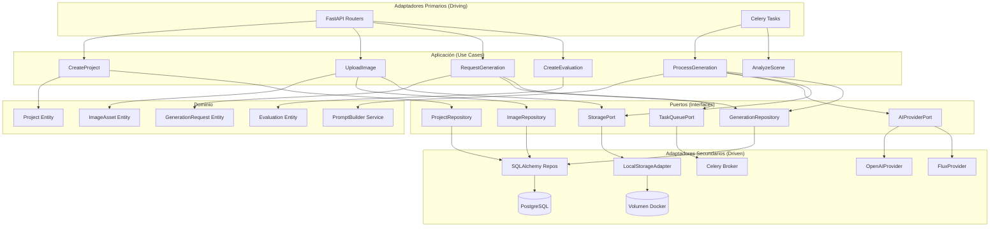
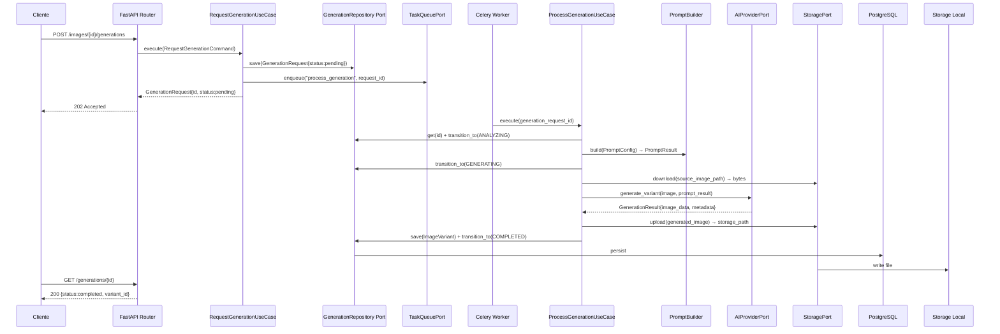
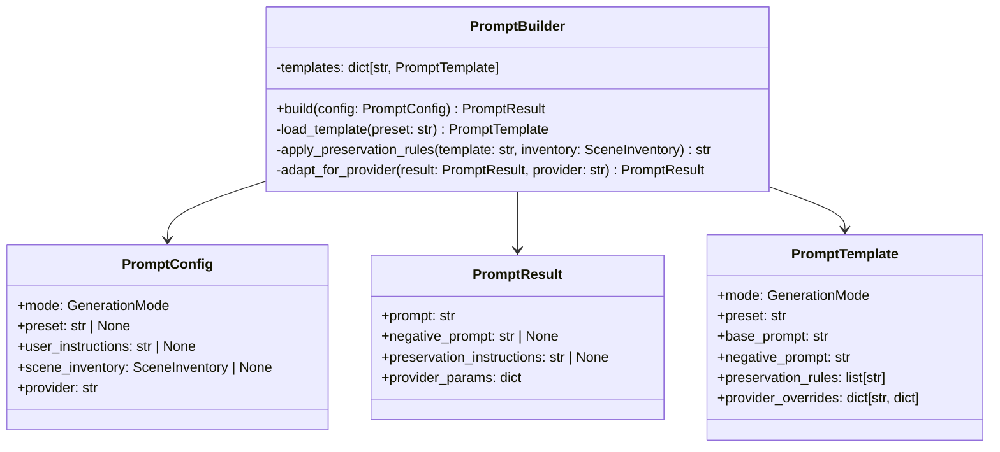
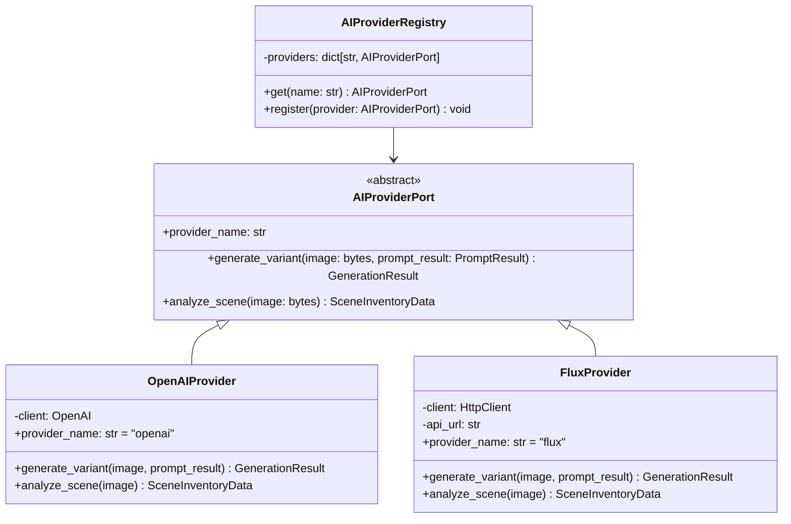
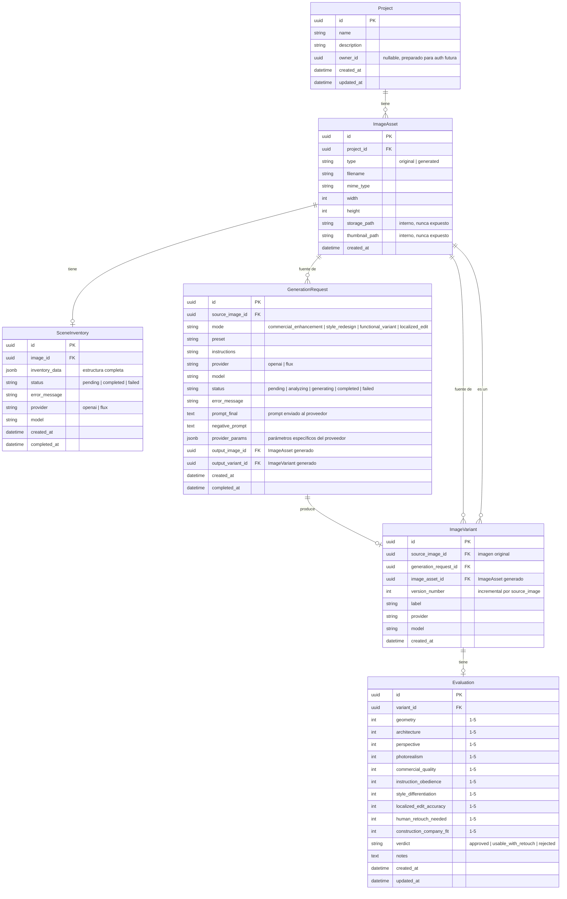

# Documento de Diseño — Backend MVP

## Visión General

Este documento describe el diseño técnico del backend MVP para la plataforma de diseño interior con IA. El sistema expone una API REST construida con **FastAPI** que permite a empresas de construcción e inmobiliarias subir imágenes de interiores, analizarlas mediante IA para obtener un inventario de escena, generar variantes de diseño con diferentes estilos y modos, y evaluar los resultados manualmente.

El backend sigue **Arquitectura Hexagonal (Ports & Adapters)** combinada con principios de **Clean Architecture**. El dominio de negocio es el núcleo del sistema y no depende de ningún framework, base de datos, proveedor de IA ni mecanismo de transporte. Todo lo externo (FastAPI, PostgreSQL, Redis, OpenAI, storage) son adaptadores intercambiables.

### Capas de la Arquitectura

```
┌─────────────────────────────────────────────────────────┐
│                    ADAPTADORES (Infraestructura)         │
│  FastAPI Routers │ SQLAlchemy Repos │ OpenAI │ Celery    │
├─────────────────────────────────────────────────────────┤
│                    PUERTOS (Interfaces)                   │
│  ProjectRepository │ ImageRepository │ AIProviderPort    │
├─────────────────────────────────────────────────────────┤
│                    APLICACIÓN (Use Cases)                 │
│  CreateProject │ UploadImage │ RequestGeneration │ ...   │
├─────────────────────────────────────────────────────────┤
│                    DOMINIO (Núcleo)                       │
│  Entities │ Value Objects │ Domain Services │ Events     │
└─────────────────────────────────────────────────────────┘
```

**Regla fundamental**: las dependencias solo apuntan hacia adentro. El dominio no importa nada de las capas externas.

### Decisiones Arquitectónicas Clave

| Decisión | Elección | Justificación |
|---|---|---|
| Arquitectura | Hexagonal + Clean Architecture | Dominio aislado, adaptadores intercambiables, alta testeabilidad |
| Framework API | FastAPI | Async nativo, validación con Pydantic, documentación OpenAPI automática |
| ORM | SQLAlchemy 2.0 + Alembic | ORM maduro con soporte async, migraciones robustas |
| Cola de tareas | Celery + Redis | Estándar de la industria para tareas asíncronas en Python, reintentos configurables |
| Base de datos | PostgreSQL + JSONB | Relacional con soporte nativo para datos semi-estructurados (SceneInventory) |
| Almacenamiento | Storage Local (volumen Docker) | Simple para MVP, sin dependencias externas. La interfaz StoragePort está abstraída para migrar a S3/R2 en producción futura |
| Proveedor IA primario | OpenAI Images API (gpt-image-1) | Edición de imágenes con referencia, alta calidad para interiores |
| Proveedor IA secundario | FLUX (Black Forest Labs) | Alternativa opcional, buena calidad texto-a-imagen |
| Versionado API | `/api/v1/` en todos los endpoints | Sin costo, evita breaking changes al evolucionar |
| Paginación | Offset/limit en todos los listados | Necesario desde el inicio para escalar |
| Observabilidad | structlog JSON + correlation_id | Trazabilidad de punta a punta sin plataforma externa |
| Rate limiting | Configurable por env vars, desactivado por defecto | Sin fricción en desarrollo, activable para producción |
| Multi-tenancy prep | `owner_id` nullable en `Project` | Preparación para auth sin cambiar el schema después |

---

## Arquitectura Hexagonal

### Estructura de Directorios

```
app/
├── domain/                          # Núcleo — sin dependencias externas
│   ├── projects/
│   │   ├── entities.py              # Project (dataclass puro)
│   │   └── repository.py            # ProjectRepository (interfaz abstracta)
│   ├── images/
│   │   ├── entities.py              # ImageAsset, ImageVariant
│   │   └── repository.py            # ImageRepository (interfaz abstracta)
│   ├── generations/
│   │   ├── entities.py              # GenerationRequest, SceneInventory
│   │   ├── value_objects.py         # GenerationMode, GenerationStatus
│   │   ├── repository.py            # GenerationRepository (interfaz abstracta)
│   │   └── services.py              # PromptBuilder (servicio de dominio puro)
│   ├── evaluations/
│   │   ├── entities.py              # Evaluation
│   │   └── repository.py            # EvaluationRepository (interfaz abstracta)
│   └── shared/
│       ├── value_objects.py         # UUID, Timestamp, etc.
│       └── exceptions.py            # Excepciones de dominio
│
├── application/                     # Casos de uso — orquesta dominio + puertos
│   ├── projects/
│   │   ├── create_project.py        # CreateProjectUseCase
│   │   ├── get_project.py
│   │   ├── list_projects.py
│   │   ├── update_project.py
│   │   └── delete_project.py
│   ├── images/
│   │   ├── upload_image.py          # UploadImageUseCase
│   │   ├── get_image.py
│   │   ├── list_images.py
│   │   └── delete_image.py
│   ├── generations/
│   │   ├── request_generation.py    # RequestGenerationUseCase
│   │   ├── get_generation.py
│   │   ├── list_generations.py
│   │   ├── analyze_scene.py         # AnalyzeSceneUseCase
│   │   └── process_generation.py    # ProcessGenerationUseCase (ejecutado por worker)
│   ├── evaluations/
│   │   ├── create_evaluation.py
│   │   ├── get_evaluation.py
│   │   └── update_evaluation.py
│   └── ports/                       # Interfaces que los use cases necesitan
│       ├── storage_port.py          # StoragePort (interfaz abstracta)
│       ├── ai_provider_port.py      # AIProviderPort (interfaz abstracta)
│       └── task_queue_port.py       # TaskQueuePort (interfaz abstracta)
│
├── infrastructure/                  # Adaptadores — implementaciones concretas
│   ├── persistence/
│   │   ├── models.py                # Modelos SQLAlchemy (ORM models, separados de entidades)
│   │   ├── database.py              # Configuración de sesión async
│   │   ├── projects/
│   │   │   └── sqlalchemy_repository.py
│   │   ├── images/
│   │   │   └── sqlalchemy_repository.py
│   │   ├── generations/
│   │   │   └── sqlalchemy_repository.py
│   │   └── evaluations/
│   │       └── sqlalchemy_repository.py
│   ├── storage/
│   │   ├── local_storage_adapter.py # LocalStorageAdapter (MVP)
│   │   └── s3_storage_adapter.py    # S3StorageAdapter (futuro, no implementado en MVP)
│   ├── ai_providers/
│   │   ├── openai_provider.py       # OpenAIProvider
│   │   └── flux_provider.py         # FluxProvider
│   ├── tasks/
│   │   ├── celery_app.py            # Configuración Celery
│   │   └── celery_tasks.py          # Tareas Celery (adaptadores de workers)
│   └── thumbnail/
│       └── pillow_thumbnail.py      # ThumbnailService con Pillow
│
├── api/                             # Adaptador HTTP — FastAPI
│   ├── main.py                      # App FastAPI, middleware, mounts
│   ├── dependencies.py              # Inyección de dependencias (wiring)
│   ├── routers/
│   │   ├── projects.py
│   │   ├── images.py
│   │   ├── scene_inventory.py
│   │   ├── generations.py
│   │   ├── variants.py
│   │   ├── evaluations.py
│   │   ├── downloads.py
│   │   └── stats.py
│   └── schemas/                     # DTOs de entrada/salida (Pydantic)
│       ├── projects.py
│       ├── images.py
│       ├── generations.py
│       └── evaluations.py
│
└── config/
    └── settings.py                  # Configuración via pydantic-settings
```

### Diagrama de Arquitectura Hexagonal



### Diagrama de Flujo: Generación de Imagen (con capas hexagonales)



---

## Dominio

### Entidades Principales

Las entidades del dominio son objetos Python puros — sin dependencias de SQLAlchemy, FastAPI ni ningún framework.

```python
# app/domain/projects/entities.py
from dataclasses import dataclass, field
from datetime import datetime
from uuid import UUID, uuid4

@dataclass
class Project:
    name: str
    description: str | None = None
    owner_id: UUID | None = None   # Nullable en MVP. Preparado para auth/multi-tenancy.
    id: UUID = field(default_factory=uuid4)
    created_at: datetime = field(default_factory=datetime.utcnow)
    updated_at: datetime = field(default_factory=datetime.utcnow)

    def update(self, name: str | None = None, description: str | None = None) -> None:
        if name is not None:
            self.name = name
        if description is not None:
            self.description = description
        self.updated_at = datetime.utcnow()
```

```python
# app/domain/generations/entities.py
from dataclasses import dataclass, field
from datetime import datetime
from enum import Enum
from uuid import UUID, uuid4

class GenerationMode(str, Enum):
    COMMERCIAL_ENHANCEMENT = "commercial_enhancement"
    STYLE_REDESIGN = "style_redesign"
    FUNCTIONAL_VARIANT = "functional_variant"
    LOCALIZED_EDIT = "localized_edit"

class GenerationStatus(str, Enum):
    PENDING = "pending"
    ANALYZING = "analyzing"
    GENERATING = "generating"
    COMPLETED = "completed"
    FAILED = "failed"

    def can_transition_to(self, next_status: "GenerationStatus") -> bool:
        valid_transitions = {
            self.PENDING: {self.ANALYZING, self.FAILED},
            self.ANALYZING: {self.GENERATING, self.FAILED},
            self.GENERATING: {self.COMPLETED, self.FAILED},
            self.COMPLETED: set(),
            self.FAILED: set(),
        }
        return next_status in valid_transitions[self]

@dataclass
class GenerationRequest:
    source_image_id: UUID
    mode: GenerationMode
    provider: str
    preset: str | None = None
    instructions: str | None = None
    status: GenerationStatus = field(default=GenerationStatus.PENDING)
    id: UUID = field(default_factory=uuid4)
    created_at: datetime = field(default_factory=datetime.utcnow)
    completed_at: datetime | None = None
    prompt_final: str | None = None
    error_message: str | None = None

    def transition_to(self, new_status: GenerationStatus) -> None:
        if not self.status.can_transition_to(new_status):
            raise ValueError(f"Invalid transition: {self.status} → {new_status}")
        self.status = new_status
        if new_status == GenerationStatus.COMPLETED:
            self.completed_at = datetime.utcnow()

    def mark_failed(self, error: str) -> None:
        self.status = GenerationStatus.FAILED
        self.error_message = error
        self.completed_at = datetime.utcnow()
```

### Puertos (Interfaces)

Los puertos son las interfaces que la capa de aplicación define y que los adaptadores de infraestructura implementan.

```python
# app/application/ports/storage_port.py
from abc import ABC, abstractmethod

class StoragePort(ABC):
    @abstractmethod
    async def upload(self, data: bytes, path: str, content_type: str) -> str:
        """Guarda archivo y retorna storage_path interno."""

    @abstractmethod
    async def download(self, path: str) -> bytes:
        """Lee archivo desde storage."""

    @abstractmethod
    async def delete(self, path: str) -> None:
        """Elimina archivo de storage."""

    @abstractmethod
    def get_url(self, path: str) -> str:
        """Retorna URL pública para acceder al archivo."""
```

```python
# app/application/ports/ai_provider_port.py
from abc import ABC, abstractmethod
from dataclasses import dataclass

@dataclass
class PromptResult:
    prompt: str
    negative_prompt: str | None
    preservation_instructions: str | None
    provider_params: dict

@dataclass
class GenerationResult:
    image_data: bytes
    provider_name: str
    model_name: str
    metadata: dict

@dataclass
class SceneInventoryData:
    inventory: dict
    provider_name: str
    model_name: str

class AIProviderPort(ABC):
    @property
    @abstractmethod
    def provider_name(self) -> str: ...

    @abstractmethod
    async def generate_variant(self, image: bytes, prompt_result: PromptResult) -> GenerationResult: ...

    @abstractmethod
    async def analyze_scene(self, image: bytes) -> SceneInventoryData: ...
```

```python
# app/application/ports/repository_ports.py
from abc import ABC, abstractmethod
from uuid import UUID
from app.domain.projects.entities import Project

class ProjectRepository(ABC):
    @abstractmethod
    async def save(self, project: Project) -> Project: ...

    @abstractmethod
    async def get_by_id(self, project_id: UUID) -> Project | None: ...

    @abstractmethod
    async def list_all(self) -> list[Project]: ...

    @abstractmethod
    async def delete(self, project_id: UUID) -> None: ...
```

### Servicio de Dominio: PromptBuilder

El PromptBuilder es un servicio de dominio puro — sin I/O, sin dependencias externas. Recibe datos y retorna datos.

```python
# app/domain/generations/services.py
from dataclasses import dataclass
from app.domain.generations.entities import GenerationMode
from app.application.ports.ai_provider_port import PromptResult

@dataclass
class PromptConfig:
    mode: GenerationMode
    preset: str | None
    user_instructions: str | None
    scene_inventory: dict | None
    provider: str

class PromptBuilder:
    """Servicio de dominio puro. Sin I/O. Sin dependencias externas."""

    TEMPLATES: dict = {
        "commercial_enhancement": {
            "base": "Transform this interior space into a premium commercial-quality photograph...",
            "negative": "avoid clutter, poor lighting, distorted proportions",
        },
        "modern_mediterranean": {
            "base": "Redesign this interior with modern Mediterranean style...",
            "negative": "avoid dark colors, heavy furniture, industrial elements",
        },
        # ... resto de plantillas definidas en infrastructure/ai_providers/prompt_templates.py
    }

    def build(self, config: PromptConfig) -> PromptResult:
        template_key = config.preset or config.mode.value
        template = self.TEMPLATES.get(template_key, self.TEMPLATES["commercial_enhancement"])

        prompt = template["base"]
        if config.user_instructions:
            prompt += f" Additional instructions: {config.user_instructions}"

        preservation = None
        if config.mode == GenerationMode.LOCALIZED_EDIT and config.scene_inventory:
            rules = config.scene_inventory.get("preservation_rules", [])
            preservation = " ".join(rules)
            prompt += f" IMPORTANT: {preservation}"

        return PromptResult(
            prompt=prompt,
            negative_prompt=template.get("negative"),
            preservation_instructions=preservation,
            provider_params=self._get_provider_params(config.provider),
        )

    def _get_provider_params(self, provider: str) -> dict:
        if provider == "openai":
            return {"model": "gpt-image-1", "quality": "high", "size": "1024x1024"}
        elif provider == "flux":
            return {"guidance_scale": 7.5, "num_inference_steps": 50}
        return {}
```

---

## Casos de Uso (Application Layer)

Cada caso de uso es una clase con un método `execute()`. Recibe un comando/query y retorna un resultado. No conoce HTTP, SQL ni ningún framework.

```python
# app/application/projects/create_project.py
from dataclasses import dataclass
from app.domain.projects.entities import Project
from app.application.ports.repository_ports import ProjectRepository

@dataclass
class CreateProjectCommand:
    name: str
    description: str | None = None

class CreateProjectUseCase:
    def __init__(self, project_repo: ProjectRepository):
        self._repo = project_repo

    async def execute(self, command: CreateProjectCommand) -> Project:
        project = Project(name=command.name, description=command.description)
        return await self._repo.save(project)
```

```python
# app/application/generations/request_generation.py
from dataclasses import dataclass
from uuid import UUID
from app.domain.generations.entities import GenerationRequest, GenerationMode
from app.application.ports.repository_ports import GenerationRepository, ImageRepository
from app.application.ports.task_queue_port import TaskQueuePort
from app.domain.shared.exceptions import ResourceNotFoundError

@dataclass
class RequestGenerationCommand:
    image_id: UUID
    mode: GenerationMode
    provider: str
    preset: str | None = None
    instructions: str | None = None

class RequestGenerationUseCase:
    def __init__(
        self,
        generation_repo: GenerationRepository,
        image_repo: ImageRepository,
        task_queue: TaskQueuePort,
    ):
        self._generation_repo = generation_repo
        self._image_repo = image_repo
        self._task_queue = task_queue

    async def execute(self, command: RequestGenerationCommand) -> GenerationRequest:
        image = await self._image_repo.get_by_id(command.image_id)
        if not image:
            raise ResourceNotFoundError(f"Image {command.image_id} not found")

        request = GenerationRequest(
            source_image_id=command.image_id,
            mode=command.mode,
            provider=command.provider,
            preset=command.preset,
            instructions=command.instructions,
        )
        saved = await self._generation_repo.save(request)
        await self._task_queue.enqueue("process_generation", str(saved.id))
        return saved
```

---

## Adaptadores (Infrastructure Layer)

### Repositorio SQLAlchemy

Los repositorios implementan los puertos del dominio. Traducen entre entidades de dominio y modelos ORM. Los modelos ORM son internos a la infraestructura y nunca se exponen al dominio.

```python
# app/infrastructure/persistence/projects/sqlalchemy_repository.py
from uuid import UUID
from sqlalchemy.ext.asyncio import AsyncSession
from app.domain.projects.entities import Project
from app.application.ports.repository_ports import ProjectRepository
from app.infrastructure.persistence.models import ProjectModel

class SQLAlchemyProjectRepository(ProjectRepository):
    def __init__(self, session: AsyncSession):
        self._session = session

    async def save(self, project: Project) -> Project:
        model = ProjectModel(
            id=project.id,
            name=project.name,
            description=project.description,
            created_at=project.created_at,
            updated_at=project.updated_at,
        )
        self._session.add(model)
        await self._session.flush()
        return self._to_entity(model)

    async def get_by_id(self, project_id: UUID) -> Project | None:
        model = await self._session.get(ProjectModel, project_id)
        return self._to_entity(model) if model else None

    def _to_entity(self, model: ProjectModel) -> Project:
        return Project(
            id=model.id,
            name=model.name,
            description=model.description,
            created_at=model.created_at,
            updated_at=model.updated_at,
        )
```

### Adaptador de Storage Local

```python
# app/infrastructure/storage/local_storage_adapter.py
from pathlib import Path
from app.application.ports.storage_port import StoragePort

class LocalStorageAdapter(StoragePort):
    """Adaptador de storage local para MVP. Implementa StoragePort."""

    def __init__(self, base_path: str, media_url_prefix: str):
        self._base_path = Path(base_path)
        self._media_url_prefix = media_url_prefix

    async def upload(self, data: bytes, path: str, content_type: str) -> str:
        full_path = self._base_path / path
        full_path.parent.mkdir(parents=True, exist_ok=True)
        full_path.write_bytes(data)
        return path

    async def download(self, path: str) -> bytes:
        full_path = self._base_path / path
        if not full_path.exists():
            raise FileNotFoundError(f"File not found: {path}")
        return full_path.read_bytes()

    async def delete(self, path: str) -> None:
        full_path = self._base_path / path
        if full_path.exists():
            full_path.unlink()

    def get_url(self, path: str) -> str:
        return f"{self._media_url_prefix}/{path}"

# Futuro: class S3StorageAdapter(StoragePort): ...
```

### Adaptador FastAPI (Router)

Los routers de FastAPI son adaptadores primarios. Traducen HTTP → comandos de use case → respuestas HTTP.

```python
# app/api/routers/projects.py
from fastapi import APIRouter, Depends, HTTPException
from uuid import UUID
from app.api.schemas.projects import ProjectCreate, ProjectUpdate, ProjectResponse
from app.api.dependencies import get_create_project_uc, get_get_project_uc
from app.application.projects.create_project import CreateProjectCommand
from app.domain.shared.exceptions import ResourceNotFoundError

router = APIRouter(prefix="/projects", tags=["projects"])

@router.post("/", response_model=ProjectResponse, status_code=201)
async def create_project(
    body: ProjectCreate,
    use_case=Depends(get_create_project_uc),
):
    project = await use_case.execute(CreateProjectCommand(
        name=body.name,
        description=body.description,
    ))
    return ProjectResponse.from_entity(project)

@router.get("/{project_id}", response_model=ProjectResponse)
async def get_project(
    project_id: UUID,
    use_case=Depends(get_get_project_uc),
):
    try:
        project = await use_case.execute(project_id)
        return ProjectResponse.from_entity(project)
    except ResourceNotFoundError as e:
        raise HTTPException(status_code=404, detail=str(e))
```

### Inyección de Dependencias

```python
# app/api/dependencies.py
from fastapi import Depends
from sqlalchemy.ext.asyncio import AsyncSession
from app.infrastructure.persistence.database import get_session
from app.infrastructure.persistence.projects.sqlalchemy_repository import SQLAlchemyProjectRepository
from app.infrastructure.storage.local_storage_adapter import LocalStorageAdapter
from app.application.projects.create_project import CreateProjectUseCase
from app.config.settings import get_settings

def get_storage(settings=Depends(get_settings)) -> LocalStorageAdapter:
    return LocalStorageAdapter(
        base_path=settings.STORAGE_LOCAL_PATH,
        media_url_prefix=settings.MEDIA_URL_PREFIX,
    )

def get_create_project_uc(session: AsyncSession = Depends(get_session)):
    repo = SQLAlchemyProjectRepository(session)
    return CreateProjectUseCase(project_repo=repo)
```

---

## Componentes e Interfaces

> Los componentes detallados a continuación corresponden a las implementaciones concretas de los puertos definidos en la capa de aplicación. Para el diseño de las interfaces abstractas, ver la sección **Dominio** y **Puertos** arriba.

### 1. Capa API (FastAPI)

La API se organiza en routers por dominio funcional. Cada router es un adaptador primario que traduce HTTP a comandos de use case. Todos los endpoints están bajo el prefijo `/api/v1/`.

| Router | Prefijo | Responsabilidad |
|---|---|---|
| `health` | `/api/v1/health` | Health check del servicio |
| `projects` | `/api/v1/projects` | CRUD de proyectos (listado paginado) |
| `images` | `/api/v1/images`, `/api/v1/projects/{id}/images` | Subida, listado paginado, eliminación de imágenes |
| `scene_inventory` | `/api/v1/images/{id}/scene-inventory` | Análisis de escena |
| `generations` | `/api/v1/images/{id}/generations`, `/api/v1/generations/{id}` | Solicitudes de generación (listado paginado) |
| `variants` | `/api/v1/image-variants/{id}` | Consulta de variantes |
| `evaluations` | `/api/v1/image-variants/{id}/evaluation`, `/api/v1/evaluations/{id}` | Evaluaciones manuales |
| `downloads` | `/api/v1/images/{id}/download` | Descarga directa de imagen |
| `stats` | `/api/v1/stats/generations` | Estadísticas de uso y costos |

#### Esquemas Pydantic Principales

```python
# Proyectos
class ProjectCreate(BaseModel):
    name: str = Field(..., min_length=1, max_length=255)
    description: str | None = None

class ProjectUpdate(BaseModel):
    name: str | None = Field(None, min_length=1, max_length=255)
    description: str | None = None

class ProjectResponse(BaseModel):
    id: UUID
    name: str
    description: str | None
    created_at: datetime
    updated_at: datetime

# Generaciones
class GenerationRequestCreate(BaseModel):
    mode: GenerationMode  # Enum
    preset: str | None = None
    instructions: str | None = None
    provider: str = "openai"  # "openai" | "flux"

class GenerationMode(str, Enum):
    COMMERCIAL_ENHANCEMENT = "commercial_enhancement"
    STYLE_REDESIGN = "style_redesign"
    FUNCTIONAL_VARIANT = "functional_variant"
    LOCALIZED_EDIT = "localized_edit"

# Evaluaciones
class EvaluationCreate(BaseModel):
    geometry: int = Field(..., ge=1, le=5)
    architecture: int = Field(..., ge=1, le=5)
    perspective: int = Field(..., ge=1, le=5)
    photorealism: int = Field(..., ge=1, le=5)
    commercial_quality: int = Field(..., ge=1, le=5)
    instruction_obedience: int = Field(..., ge=1, le=5)
    style_differentiation: int = Field(..., ge=1, le=5)
    localized_edit_accuracy: int = Field(..., ge=1, le=5)
    human_retouch_needed: int = Field(..., ge=1, le=5)
    construction_company_fit: int = Field(..., ge=1, le=5)
    verdict: EvaluationVerdict  # Enum
    notes: str | None = None

class EvaluationVerdict(str, Enum):
    APPROVED = "approved"
    USABLE_WITH_RETOUCH = "usable_with_retouch"
    REJECTED = "rejected"
```

### 2. PromptBuilder

Componente puro (sin I/O) que construye el prompt final a partir de los parámetros de generación.



**Flujo de construcción:**

1. Seleccionar la plantilla base según `mode` y `preset`.
2. Inyectar las `user_instructions` en el prompt base.
3. Si existe `scene_inventory`, incorporar los elementos de la escena y las reglas de preservación (especialmente para `localized_edit`).
4. Generar `negative_prompt` con los elementos que deben preservarse.
5. Adaptar los parámetros al proveedor seleccionado (OpenAI usa `prompt` + imagen de referencia; FLUX usa `prompt` + `guidance_scale`).
6. Retornar `PromptResult` con toda la información necesaria.

**Plantillas soportadas (presets):**

| Modo | Presets |
|---|---|
| `commercial_enhancement` | `commercial_enhancement` (default) |
| `style_redesign` | `modern_mediterranean`, `premium_contemporary`, `urban_contemporary` |
| `functional_variant` | `living_tv_wall`, `dining_room`, `home_office_lounge` |
| `localized_edit` | `localized_wall_art`, `localized_sofa`, `localized_rug`, `localized_tv_cabinet`, `localized_remove_plants`, `localized_wall_color` |

### 3. AIProviderPort y Adaptadores de Proveedores

Implementa el patrón Strategy a través del puerto `AIProviderPort`. Cada proveedor es un adaptador secundario que implementa la interfaz definida en la capa de aplicación.



**Registro de proveedores (en `dependencies.py`):**

```python
def get_ai_provider_registry(settings=Depends(get_settings)) -> AIProviderRegistry:
    registry = AIProviderRegistry()
    registry.register(OpenAIProvider(api_key=settings.OPENAI_API_KEY))
    if settings.FLUX_ENABLED:
        registry.register(FluxProvider(api_url=settings.FLUX_API_URL, api_key=settings.FLUX_API_KEY))
    return registry
```

### 4. Celery Workers (Adaptadores de Workers)

Los workers Celery son adaptadores primarios que invocan use cases de la capa de aplicación. No contienen lógica de negocio.

#### Tarea: `analyze_scene`

```python
@celery_app.task(bind=True, max_retries=2, default_retry_delay=30)
def analyze_scene(self, image_id: str):
    """
    Adaptador Celery → AnalyzeSceneUseCase
    1. Resolver dependencias (repo, storage, ai_provider)
    2. Invocar AnalyzeSceneUseCase.execute(image_id)
    3. El use case maneja toda la lógica y transiciones de estado
    """
```

#### Tarea: `process_generation`

```python
@celery_app.task(bind=True, max_retries=2, default_retry_delay=60)
def process_generation(self, generation_request_id: str):
    """
    Adaptador Celery → ProcessGenerationUseCase
    1. Resolver dependencias (repos, storage, ai_provider, prompt_builder)
    2. Invocar ProcessGenerationUseCase.execute(generation_request_id)
    3. El use case maneja: analyzing → building prompt → generating → completed/failed
    """
```

### 5. StoragePort y LocalStorageAdapter

Ver implementación completa en la sección **Adaptadores (Infrastructure Layer)** arriba. El puerto `StoragePort` está definido en `app/application/ports/storage_port.py`. La implementación MVP es `LocalStorageAdapter` en `app/infrastructure/storage/local_storage_adapter.py`.

**Convención de rutas en Storage (dentro del volumen Docker `/app/media/`):**

```
projects/{project_id}/originals/{image_id}.{ext}
projects/{project_id}/originals/{image_id}_thumb.{ext}
projects/{project_id}/generated/{variant_id}.{ext}
projects/{project_id}/generated/{variant_id}_thumb.{ext}
```

---

## Modelos de Datos

### Diagrama Entidad-Relación



### Estructura del SceneInventory (JSONB)

```json
{
  "scene_type": "living_room",
  "camera": {
    "angle": "eye_level",
    "perspective": "wide",
    "focal_point": "center"
  },
  "architecture": {
    "must_preserve": true,
    "elements": [
      {"type": "wall", "material": "painted", "color": "white"},
      {"type": "floor", "material": "hardwood", "color": "oak"},
      {"type": "window", "position": "left_wall", "style": "floor_to_ceiling"},
      {"type": "ceiling", "style": "flat", "height": "standard"}
    ]
  },
  "furniture": [
    {"type": "sofa", "style": "modern", "color": "gray", "position": "center"},
    {"type": "coffee_table", "style": "minimalist", "material": "glass", "position": "center_front"}
  ],
  "decoration": [
    {"type": "plant", "subtype": "potted", "position": "corner_right"},
    {"type": "artwork", "position": "wall_behind_sofa"}
  ],
  "editable_candidates": [
    {"element": "sofa", "edit_types": ["replace", "recolor"]},
    {"element": "coffee_table", "edit_types": ["replace"]},
    {"element": "artwork", "edit_types": ["replace", "remove"]},
    {"element": "plant", "edit_types": ["remove", "replace"]}
  ],
  "preservation_rules": [
    "Preserve all architectural elements (walls, floor, ceiling, windows)",
    "Maintain camera angle and perspective",
    "Keep room proportions and spatial layout"
  ]
}
```

### Modelos SQLAlchemy

```python
from sqlalchemy import Column, String, Integer, Text, DateTime, ForeignKey, Enum as SAEnum
from sqlalchemy.dialects.postgresql import UUID, JSONB
from sqlalchemy.orm import relationship, DeclarativeBase
import uuid
from datetime import datetime, timezone

class Base(DeclarativeBase):
    pass

class Project(Base):
    __tablename__ = "projects"
    id = Column(UUID(as_uuid=True), primary_key=True, default=uuid.uuid4)
    name = Column(String(255), nullable=False)
    description = Column(Text, nullable=True)
    created_at = Column(DateTime(timezone=True), default=lambda: datetime.now(timezone.utc))
    updated_at = Column(DateTime(timezone=True), default=lambda: datetime.now(timezone.utc), onupdate=lambda: datetime.now(timezone.utc))
    images = relationship("ImageAsset", back_populates="project", cascade="all, delete-orphan")

class ImageAsset(Base):
    __tablename__ = "image_assets"
    id = Column(UUID(as_uuid=True), primary_key=True, default=uuid.uuid4)
    project_id = Column(UUID(as_uuid=True), ForeignKey("projects.id", ondelete="CASCADE"), nullable=False)
    type = Column(String(20), nullable=False)  # "original" | "generated"
    filename = Column(String(255), nullable=False)
    mime_type = Column(String(50), nullable=False)
    width = Column(Integer, nullable=True)
    height = Column(Integer, nullable=True)
    storage_path = Column(String(500), nullable=False)
    thumbnail_path = Column(String(500), nullable=True)
    created_at = Column(DateTime(timezone=True), default=lambda: datetime.now(timezone.utc))
    project = relationship("Project", back_populates="images")
    scene_inventory = relationship("SceneInventory", back_populates="image", uselist=False)
    source_variants = relationship("ImageVariant", foreign_keys="ImageVariant.source_image_id", back_populates="source_image")

class SceneInventory(Base):
    __tablename__ = "scene_inventories"
    id = Column(UUID(as_uuid=True), primary_key=True, default=uuid.uuid4)
    image_id = Column(UUID(as_uuid=True), ForeignKey("image_assets.id", ondelete="CASCADE"), unique=True, nullable=False)
    inventory_data = Column(JSONB, nullable=True)
    status = Column(String(20), nullable=False, default="pending")
    error_message = Column(Text, nullable=True)
    provider = Column(String(50), nullable=True)
    model = Column(String(100), nullable=True)
    created_at = Column(DateTime(timezone=True), default=lambda: datetime.now(timezone.utc))
    completed_at = Column(DateTime(timezone=True), nullable=True)
    image = relationship("ImageAsset", back_populates="scene_inventory")

class GenerationRequest(Base):
    __tablename__ = "generation_requests"
    id = Column(UUID(as_uuid=True), primary_key=True, default=uuid.uuid4)
    source_image_id = Column(UUID(as_uuid=True), ForeignKey("image_assets.id", ondelete="CASCADE"), nullable=False)
    mode = Column(String(30), nullable=False)
    preset = Column(String(50), nullable=True)
    instructions = Column(Text, nullable=True)
    provider = Column(String(50), nullable=False, default="openai")
    model = Column(String(100), nullable=True)
    status = Column(String(20), nullable=False, default="pending")
    error_message = Column(Text, nullable=True)
    prompt_final = Column(Text, nullable=True)
    negative_prompt = Column(Text, nullable=True)
    provider_params = Column(JSONB, nullable=True)
    output_image_id = Column(UUID(as_uuid=True), ForeignKey("image_assets.id"), nullable=True)
    output_variant_id = Column(UUID(as_uuid=True), ForeignKey("image_variants.id"), nullable=True)
    created_at = Column(DateTime(timezone=True), default=lambda: datetime.now(timezone.utc))
    completed_at = Column(DateTime(timezone=True), nullable=True)
    source_image = relationship("ImageAsset", foreign_keys=[source_image_id])
    output_variant = relationship("ImageVariant", back_populates="generation_request")

class ImageVariant(Base):
    __tablename__ = "image_variants"
    id = Column(UUID(as_uuid=True), primary_key=True, default=uuid.uuid4)
    source_image_id = Column(UUID(as_uuid=True), ForeignKey("image_assets.id", ondelete="CASCADE"), nullable=False)
    generation_request_id = Column(UUID(as_uuid=True), ForeignKey("generation_requests.id"), nullable=False)
    image_asset_id = Column(UUID(as_uuid=True), ForeignKey("image_assets.id"), nullable=False)
    version_number = Column(Integer, nullable=False)
    label = Column(String(255), nullable=True)
    provider = Column(String(50), nullable=False)
    model = Column(String(100), nullable=True)
    created_at = Column(DateTime(timezone=True), default=lambda: datetime.now(timezone.utc))
    source_image = relationship("ImageAsset", foreign_keys=[source_image_id], back_populates="source_variants")
    generation_request = relationship("GenerationRequest", back_populates="output_variant")
    image_asset = relationship("ImageAsset", foreign_keys=[image_asset_id])
    evaluation = relationship("Evaluation", back_populates="variant", uselist=False)

class Evaluation(Base):
    __tablename__ = "evaluations"
    id = Column(UUID(as_uuid=True), primary_key=True, default=uuid.uuid4)
    variant_id = Column(UUID(as_uuid=True), ForeignKey("image_variants.id", ondelete="CASCADE"), unique=True, nullable=False)
    geometry = Column(Integer, nullable=False)
    architecture = Column(Integer, nullable=False)
    perspective = Column(Integer, nullable=False)
    photorealism = Column(Integer, nullable=False)
    commercial_quality = Column(Integer, nullable=False)
    instruction_obedience = Column(Integer, nullable=False)
    style_differentiation = Column(Integer, nullable=False)
    localized_edit_accuracy = Column(Integer, nullable=False)
    human_retouch_needed = Column(Integer, nullable=False)
    construction_company_fit = Column(Integer, nullable=False)
    verdict = Column(String(30), nullable=False)
    notes = Column(Text, nullable=True)
    created_at = Column(DateTime(timezone=True), default=lambda: datetime.now(timezone.utc))
    updated_at = Column(DateTime(timezone=True), default=lambda: datetime.now(timezone.utc), onupdate=lambda: datetime.now(timezone.utc))
    variant = relationship("ImageVariant", back_populates="evaluation")
```


---

## Propiedades de Correctitud

*Una propiedad es una característica o comportamiento que debe cumplirse en todas las ejecuciones válidas de un sistema — esencialmente, una declaración formal sobre lo que el sistema debe hacer. Las propiedades sirven como puente entre especificaciones legibles por humanos y garantías de correctitud verificables por máquinas.*

### Propiedad 1: Round-trip de Proyecto (crear → obtener)

*Para cualquier* nombre de proyecto válido (no vacío, ≤255 caracteres) y descripción opcional, crear un Proyecto vía POST y luego obtenerlo vía GET por su id debe retornar un recurso con el mismo nombre y descripción, además de id, created_at y updated_at no nulos.

**Valida: Requisitos 1.1, 1.3**

### Propiedad 2: Actualización parcial de Proyecto preserva campos no modificados

*Para cualquier* Proyecto existente y cualquier subconjunto de campos actualizables (nombre, descripción), al enviar un PATCH con solo esos campos, únicamente los campos proporcionados deben cambiar en el recurso retornado; los campos no incluidos en el PATCH deben permanecer idénticos a sus valores anteriores.

**Valida: Requisitos 1.4**

### Propiedad 3: Round-trip de metadatos de imagen (subir → obtener)

*Para cualquier* imagen válida (JPEG, PNG o WebP dentro del límite de tamaño), al subirla a un proyecto y luego obtener sus metadatos vía GET, el ImageAsset retornado debe contener filename, mime_type, width y height coincidentes con las propiedades reales del archivo subido, y type debe ser "original".

**Valida: Requisitos 2.1, 2.2, 2.4**

### Propiedad 4: Las rutas internas de Storage nunca se exponen al cliente

*Para cualquier* respuesta de la API que contenga datos de imagen (listados, detalles, comparaciones, descargas), el cuerpo de la respuesta JSON nunca debe contener el campo `storage_path` ni `thumbnail_path` con valores de rutas internas de almacenamiento.

**Valida: Requisitos 3.1, 3.4, 14.3**

### Propiedad 5: Todo acceso a imágenes usa URLs servidas por la API

*Para cualquier* imagen almacenada (original o generada), cuando el cliente solicita acceso, la API debe retornar una URL servida a través de un endpoint de la API (ej: `/media/{path}`), nunca una ruta directa al sistema de archivos local.

**Valida: Requisitos 3.2, 11.1, 14.4**

### Propiedad 6: Toda imagen tiene un thumbnail generado al momento de creación

*Para cualquier* ImageAsset creado (ya sea por subida de imagen original o por generación de variante), debe existir un thumbnail asociado cuyas dimensiones sean menores o iguales al tamaño máximo configurado.

**Valida: Requisitos 3.3, 8.4**

### Propiedad 7: SceneInventory almacena campos requeridos al completarse

*Para cualquier* análisis de escena completado exitosamente, el SceneInventory almacenado debe contener inventory_data no nulo con los campos scene_type, architecture y preservation_rules, además de provider y model no nulos.

**Valida: Requisitos 4.2, 4.4**

### Propiedad 8: Solicitudes asíncronas retornan inmediatamente con estado "pending"

*Para cualquier* solicitud válida de generación de imagen o análisis de escena, la API debe retornar inmediatamente (sin esperar al procesamiento) con el identificador del recurso creado y estado "pending".

**Valida: Requisitos 5.1, 12.2**

### Propiedad 9: Validación de modos de generación

*Para cualquier* string que sea uno de los cuatro modos válidos (commercial_enhancement, style_redesign, functional_variant, localized_edit), la API debe aceptar la solicitud. *Para cualquier* string que no pertenezca a ese conjunto, la API debe retornar HTTP 422.

**Valida: Requisitos 5.2, 5.7**

### Propiedad 10: Transiciones de estado del GenerationRequest siguen la secuencia válida

*Para cualquier* GenerationRequest procesado exitosamente, las transiciones de estado deben seguir estrictamente la secuencia: pending → analyzing → generating → completed. No debe existir ninguna transición que salte un estado o retroceda en la secuencia.

**Valida: Requisitos 5.5**

### Propiedad 11: Fallo del Worker siempre resulta en estado "failed"

*Para cualquier* tarea de generación o análisis que falle durante el procesamiento (error del proveedor, timeout, excepción), el recurso asociado debe terminar en estado "failed" con un error_message no vacío, y nunca quedar en un estado intermedio ("analyzing", "generating").

**Valida: Requisitos 5.6, 12.4**

### Propiedad 12: PromptBuilder produce salida válida para toda configuración válida

*Para cualquier* combinación válida de modo de generación, preset correspondiente al modo, instrucciones de usuario (string arbitrario) y proveedor ("openai" o "flux"), el PromptBuilder debe retornar un PromptResult con prompt no vacío y provider_params no nulo.

**Valida: Requisitos 6.1, 6.4**

### Propiedad 13: PromptBuilder incluye reglas de preservación en modo localized_edit

*Para cualquier* SceneInventory con reglas de preservación no vacías, cuando el PromptBuilder construye un prompt en modo localized_edit, el prompt final o las preservation_instructions deben contener las reglas de preservación del inventario.

**Valida: Requisitos 6.3**

### Propiedad 14: ProviderRouter resuelve el proveedor correcto por nombre

*Para cualquier* nombre de proveedor registrado en el ProviderRouter, invocar get_provider(nombre) debe retornar una instancia de ImageGenerationProvider cuyo provider_name coincida con el nombre solicitado.

**Valida: Requisitos 7.3**

### Propiedad 15: Números de versión son secuenciales por imagen fuente

*Para cualquier* imagen fuente con N variantes generadas, los version_number de sus ImageVariant deben ser exactamente la secuencia 1, 2, 3, ..., N sin huecos ni duplicados, y deben estar ordenados cronológicamente.

**Valida: Requisitos 8.2, 9.2**

### Propiedad 16: Las generaciones nunca sobrescriben imágenes existentes

*Para cualquier* secuencia de generaciones sobre una misma imagen fuente, la imagen original y todas las variantes previamente generadas deben permanecer inalteradas (mismo storage_path, mismos metadatos) después de cada nueva generación.

**Valida: Requisitos 8.5**

### Propiedad 17: Validación de puntuaciones y veredictos de Evaluación

*Para cualquier* entero en el rango [1, 5], la API debe aceptarlo como puntuación válida en cualquier dimensión de evaluación. *Para cualquier* entero fuera de [1, 5], la API debe retornar HTTP 422. *Para cualquier* string en {approved, usable_with_retouch, rejected}, la API debe aceptarlo como veredicto. *Para cualquier* string fuera de ese conjunto, la API debe retornar HTTP 422.

**Valida: Requisitos 10.2, 10.3, 10.7, 10.8**

### Propiedad 18: Round-trip de Evaluación (crear → obtener)

*Para cualquier* conjunto válido de puntuaciones (1-5 en cada dimensión), veredicto válido y notas opcionales, crear una Evaluación y luego obtenerla vía GET debe retornar todos los campos con los mismos valores proporcionados.

**Valida: Requisitos 10.1, 10.5**

### Propiedad 19: Actualización parcial de Evaluación preserva campos no modificados

*Para cualquier* Evaluación existente y cualquier subconjunto de campos actualizables, al enviar un PATCH con solo esos campos, únicamente los campos proporcionados deben cambiar; los demás deben permanecer idénticos.

**Valida: Requisitos 10.6**

### Propiedad 20: Comparación retorna original + todas las variantes con metadatos

*Para cualquier* imagen fuente con N variantes generadas, la respuesta de comparación debe incluir la imagen original con URL servida por la API y exactamente N variantes, cada una con URL servida y los metadatos del GenerationRequest asociado (modo, preset, proveedor).

**Valida: Requisitos 9.1, 9.3**

### Propiedad 21: Completitud de datos de trazabilidad

*Para cualquier* GenerationRequest completado exitosamente, deben estar registrados: source_image_id, prompt_final, provider, model, status="completed", output_image_id y output_variant_id, todos no nulos. Además, created_at y completed_at deben estar presentes con completed_at ≥ created_at.

**Valida: Requisitos 13.1, 13.2, 16.1**

### Propiedad 22: Estadísticas de generación agrupan correctamente

*Para cualquier* conjunto de GenerationRequests con diferentes proveedores, proyectos y fechas, el endpoint de estadísticas debe retornar conteos que coincidan exactamente con los conteos reales al agrupar por proveedor, por proyecto y por período. Las generaciones fallidas deben contabilizarse separadamente de las completadas.

**Valida: Requisitos 16.2, 16.3**

### Propiedad 23: Validación de tipo MIME contra lista blanca

*Para cualquier* archivo con tipo MIME en {image/jpeg, image/png, image/webp}, la API debe aceptar la subida. *Para cualquier* archivo con tipo MIME fuera de ese conjunto, la API debe rechazar la solicitud con HTTP 422 antes de almacenar el archivo en Storage.

**Valida: Requisitos 2.6, 14.1, 14.6**

### Propiedad 24: Filtrado de generaciones retorna resultados correctos

*Para cualquier* filtro aplicado (por proyecto, por imagen fuente, o por proveedor), todos los GenerationRequests retornados deben cumplir el criterio del filtro, y ningún GenerationRequest que cumpla el criterio debe ser omitido del resultado.

**Valida: Requisitos 13.3**

---

## Infraestructura Docker

### Docker Compose — Servicios

```yaml
# docker-compose.yml
services:
  api:
    build:
      context: .
      dockerfile: Dockerfile
      target: production
    ports:
      - "8000:8000"
    volumes:
      - media_data:/app/media
    depends_on:
      db:
        condition: service_healthy
      redis:
        condition: service_healthy
    env_file: .env
    command: >
      sh -c "alembic upgrade head &&
             uvicorn app.main:app --host 0.0.0.0 --port 8000"

  celery-worker:
    build:
      context: .
      dockerfile: Dockerfile
      target: production
    volumes:
      - media_data:/app/media
    depends_on:
      db:
        condition: service_healthy
      redis:
        condition: service_healthy
    env_file: .env
    command: celery -A app.worker worker --loglevel=info --concurrency=2

  db:
    image: postgres:16-alpine
    volumes:
      - pg_data:/var/lib/postgresql/data
    environment:
      POSTGRES_DB: ${POSTGRES_DB:-interiorai}
      POSTGRES_USER: ${POSTGRES_USER:-interiorai}
      POSTGRES_PASSWORD: ${POSTGRES_PASSWORD:-changeme}
    ports:
      - "5432:5432"
    healthcheck:
      test: ["CMD-SHELL", "pg_isready -U ${POSTGRES_USER:-interiorai}"]
      interval: 5s
      timeout: 5s
      retries: 5

  redis:
    image: redis:7-alpine
    ports:
      - "6379:6379"
    healthcheck:
      test: ["CMD", "redis-cli", "ping"]
      interval: 5s
      timeout: 5s
      retries: 5

volumes:
  media_data:    # Imágenes originales y generadas
  pg_data:       # Datos de PostgreSQL
```

### Dockerfile Multi-Stage

```dockerfile
# Dockerfile
FROM python:3.12-slim AS base
WORKDIR /app
RUN apt-get update && apt-get install -y --no-install-recommends \
    libpq-dev gcc && rm -rf /var/lib/apt/lists/*

FROM base AS dependencies
COPY requirements.txt .
RUN pip install --no-cache-dir -r requirements.txt

FROM dependencies AS production
COPY . .
RUN mkdir -p /app/media
EXPOSE 8000
```

### Variables de Entorno (.env)

```env
# Base de datos
POSTGRES_DB=interiorai
POSTGRES_USER=interiorai
POSTGRES_PASSWORD=changeme
DATABASE_URL=postgresql+asyncpg://interiorai:changeme@db:5432/interiorai

# Redis
REDIS_URL=redis://redis:6379/0
CELERY_BROKER_URL=redis://redis:6379/0
CELERY_RESULT_BACKEND=redis://redis:6379/1

# Storage
STORAGE_BACKEND=local
STORAGE_LOCAL_PATH=/app/media
MEDIA_URL_PREFIX=/media

# Proveedores IA
OPENAI_API_KEY=sk-...
FLUX_ENABLED=false
FLUX_API_URL=
FLUX_API_KEY=

# Aplicación
APP_ENV=development
MAX_UPLOAD_SIZE_MB=20
ALLOWED_MIME_TYPES=image/jpeg,image/png,image/webp

# Rate limiting (desactivado por defecto — sin límites en desarrollo/testing)
RATE_LIMIT_ENABLED=false
RATE_LIMIT_GENERATIONS_PER_DAY=50

# Observabilidad
LOG_LEVEL=INFO
LOG_FORMAT=json
```

### Perfiles de Entorno

| Configuración | Desarrollo | Staging | Producción |
|---|---|---|---|
| STORAGE_BACKEND | local | local o s3 | s3 |
| APP_ENV | development | staging | production |
| DEBUG | true | false | false |
| DB | PostgreSQL local | PostgreSQL managed | PostgreSQL managed |
| Workers | 1 | 2 | 4+ |
| RATE_LIMIT_ENABLED | false | false | true |
| RATE_LIMIT_GENERATIONS_PER_DAY | — | — | 50 (configurable) |
| LOG_FORMAT | json | json | json |

Para staging/producción, se usa un `docker-compose.prod.yml` override que:
- Desactiva puertos expuestos de DB y Redis
- Configura réplicas de workers
- Usa imágenes pre-built del registry
- Monta volúmenes persistentes del host o usa EBS/EFS

---

## Observabilidad

### Logs JSON Estructurados con structlog

Todos los logs del sistema usan `structlog` en formato JSON. Esto permite ingestión directa en cualquier plataforma (Datadog, Loki, CloudWatch, etc.) sin cambios de código.

```python
# app/config/logging.py
import structlog

structlog.configure(
    processors=[
        structlog.contextvars.merge_contextvars,
        structlog.processors.add_log_level,
        structlog.processors.TimeStamper(fmt="iso"),
        structlog.processors.JSONRenderer(),
    ],
    wrapper_class=structlog.make_filtering_bound_logger(logging.INFO),
)
```

### Correlation ID

Cada request HTTP genera un `correlation_id` (UUID) que se propaga a todos los logs y tareas Celery del mismo flujo.

```python
# app/api/middleware/correlation.py
import uuid
from starlette.middleware.base import BaseHTTPMiddleware
import structlog

class CorrelationIDMiddleware(BaseHTTPMiddleware):
    async def dispatch(self, request, call_next):
        correlation_id = request.headers.get("X-Correlation-ID", str(uuid.uuid4()))
        structlog.contextvars.bind_contextvars(correlation_id=correlation_id)
        response = await call_next(request)
        response.headers["X-Correlation-ID"] = correlation_id
        structlog.contextvars.clear_contextvars()
        return response
```

**Propagación al worker Celery**: el `correlation_id` se pasa como argumento a la tarea y se vincula al contexto de structlog al inicio de cada tarea.

### Campos de Log por Evento

| Evento | Campos incluidos |
|---|---|
| Request HTTP | method, path, status_code, duration_ms, correlation_id |
| Error | error_type, message, traceback, correlation_id, context |
| Generación encolada | generation_request_id, image_id, mode, provider, correlation_id |
| Generación completada | generation_request_id, provider, model, duration_ms, correlation_id |
| Generación fallida | generation_request_id, error, provider, correlation_id |
| Análisis de escena | image_id, provider, duration_ms, correlation_id |

---

## Rate Limiting

### Diseño Configurable

El rate limiting es un middleware que se activa/desactiva por variable de entorno. Cuando está desactivado, no añade ninguna latencia ni lógica al flujo.

```python
# app/api/middleware/rate_limit.py
from fastapi import Request, HTTPException
import redis.asyncio as redis

class RateLimitMiddleware(BaseHTTPMiddleware):
    """
    Solo activo cuando RATE_LIMIT_ENABLED=true.
    Usa Redis para contar generaciones por owner_id o IP.
    Ventana deslizante de 24 horas.
    """
    async def dispatch(self, request: Request, call_next):
        if not settings.RATE_LIMIT_ENABLED:
            return await call_next(request)

        # Solo aplica a endpoints de generación
        if not request.url.path.endswith("/generations"):
            return await call_next(request)

        key = self._get_rate_limit_key(request)
        count = await self._redis.incr(key)
        if count == 1:
            await self._redis.expire(key, 86400)  # 24h

        if count > settings.RATE_LIMIT_GENERATIONS_PER_DAY:
            raise HTTPException(
                status_code=429,
                detail={
                    "error": "rate_limit_exceeded",
                    "limit": settings.RATE_LIMIT_GENERATIONS_PER_DAY,
                    "reset_in_seconds": await self._redis.ttl(key),
                }
            )
        return await call_next(request)
```

### Variables de Entorno

```env
# Rate limiting (desactivado por defecto)
RATE_LIMIT_ENABLED=false
RATE_LIMIT_GENERATIONS_PER_DAY=50
```

---

## Manejo de Errores

### Estrategia General

El sistema implementa un manejo de errores en capas:

#### 1. Capa API — Errores de Validación

FastAPI con Pydantic maneja automáticamente la validación de entrada. Los errores se retornan en formato consistente:

```json
{
  "detail": [
    {
      "loc": ["body", "name"],
      "msg": "field required",
      "type": "value_error.missing"
    }
  ]
}
```

| Código HTTP | Escenario |
|---|---|
| 400 | Solicitud malformada |
| 404 | Recurso no encontrado |
| 413 | Archivo excede tamaño máximo |
| 422 | Error de validación (tipo MIME, modo inválido, puntuación fuera de rango) |
| 500 | Error interno no esperado |

#### 2. Capa API — Excepciones de Dominio

Se definen excepciones personalizadas que se mapean a respuestas HTTP:

```python
class ResourceNotFoundError(Exception):
    """Recurso no encontrado en la base de datos."""

class InvalidFileTypeError(Exception):
    """Tipo MIME no permitido."""

class FileTooLargeError(Exception):
    """Archivo excede el tamaño máximo."""

class ProviderNotAvailableError(Exception):
    """Proveedor de IA no disponible o no configurado."""

class GenerationFailedError(Exception):
    """Error durante la generación de imagen."""
```

Se registran exception handlers globales en FastAPI:

```python
@app.exception_handler(ResourceNotFoundError)
async def resource_not_found_handler(request, exc):
    return JSONResponse(status_code=404, content={"detail": str(exc)})
```

#### 3. Capa Worker — Errores de Procesamiento

Los workers Celery implementan manejo de errores con las siguientes garantías:

- **Try/catch envolvente**: Toda la lógica del worker está envuelta en try/except.
- **Estado "failed"**: Si ocurre cualquier excepción, el recurso se actualiza a estado "failed" con el mensaje de error.
- **Sin estados intermedios**: Si el worker falla entre transiciones de estado, un mecanismo de cleanup detecta recursos en estados intermedios por más de un timeout configurable y los marca como "failed".
- **Reintentos**: Las tareas se configuran con `max_retries=2` y `default_retry_delay` para errores transitorios del proveedor.
- **Logging estructurado**: Cada error se registra con context (task_id, generation_request_id, provider, traceback).

```python
@celery_app.task(bind=True, max_retries=2, default_retry_delay=60)
def generate_image(self, generation_request_id: str):
    try:
        # ... lógica de generación ...
    except ProviderTemporaryError as exc:
        # Error transitorio del proveedor: reintentar
        self.retry(exc=exc)
    except Exception as exc:
        # Error definitivo: marcar como failed
        update_generation_status(generation_request_id, "failed", str(exc))
        logger.error(
            "Generation failed",
            extra={"generation_request_id": generation_request_id, "error": str(exc)},
            exc_info=True
        )
```

#### 4. Capa Storage — Errores de Almacenamiento

- **Upload fallido**: Si la escritura en disco local falla (permisos, espacio), se propaga la excepción al worker que la maneja según la estrategia anterior.
- **Download fallido**: Si la lectura falla (archivo no encontrado en disco), se retorna 404 al cliente.
- **Nota para producción futura**: Al migrar a S3/R2, se añadirá manejo de URLs firmadas expiradas.

---

## Estrategia de Testing

### Enfoque Dual: Tests Unitarios + Tests de Propiedades

El proyecto utiliza un enfoque dual de testing:

1. **Tests unitarios (pytest)**: Verifican ejemplos específicos, casos borde y condiciones de error.
2. **Tests de propiedades (Hypothesis)**: Verifican propiedades universales con entradas generadas aleatoriamente.

Ambos son complementarios: los tests unitarios capturan bugs concretos, los tests de propiedades verifican correctitud general.

### Librería de Property-Based Testing

**Hypothesis** (Python) — la librería estándar de PBT para Python. Se integra nativamente con pytest.

### Configuración de Tests de Propiedades

- **Mínimo 100 iteraciones** por test de propiedad (`@settings(max_examples=100)`)
- Cada test de propiedad referencia su propiedad del documento de diseño
- Formato de tag: `Feature: backend-mvp, Property {N}: {título}`

### Estructura de Tests

```
tests/
├── unit/
│   ├── test_projects.py          # CRUD de proyectos
│   ├── test_images.py            # Subida y gestión de imágenes
│   ├── test_scene_inventory.py   # Análisis de escena
│   ├── test_generations.py       # Solicitudes de generación
│   ├── test_evaluations.py       # Evaluaciones
│   ├── test_prompt_builder.py    # Construcción de prompts
│   ├── test_provider_router.py   # Enrutamiento de proveedores
│   └── test_storage_service.py   # Servicio de almacenamiento
├── properties/
│   ├── test_project_properties.py
│   ├── test_image_properties.py
│   ├── test_generation_properties.py
│   ├── test_evaluation_properties.py
│   ├── test_prompt_builder_properties.py
│   └── test_provider_router_properties.py
├── integration/
│   ├── test_celery_tasks.py      # Tareas Celery end-to-end
│   ├── test_storage.py            # Operaciones de storage local
│   └── test_generation_flow.py   # Flujo completo de generación
└── conftest.py                   # Fixtures compartidos (DB, mocks)
```

### Estrategia por Componente

| Componente | Tests Unitarios | Tests de Propiedades | Tests de Integración |
|---|---|---|---|
| Proyectos API | CRUD, validación 422, 404 | Props 1, 2 (round-trip, partial update) | — |
| Imágenes API | Subida, metadatos, eliminación | Props 3, 4, 5, 6, 23 (round-trip, seguridad, thumbnails, MIME) | Subida real a storage local |
| SceneInventory | Consulta, 404 | Prop 7 (campos requeridos) | Tarea Celery completa |
| Generaciones API | Creación, listado, estados | Props 8, 9, 10, 15, 16, 21, 24 (async, validación, estados, versiones) | Flujo completo con worker |
| PromptBuilder | Plantillas específicas, presets | Props 12, 13 (salida válida, preservación) | — |
| ProviderRouter | Registro, resolución | Prop 14 (resolución correcta) | Llamada real a OpenAI |
| Evaluaciones API | CRUD, validación | Props 17, 18, 19 (validación, round-trip, partial update) | — |
| Comparación API | Respuesta con variantes | Prop 20 (original + variantes + metadatos) | — |
| Estadísticas API | Agrupación, filtrado | Prop 22 (agregación correcta) | — |
| Workers Celery | — | Prop 11 (fallo → "failed") | Tarea completa con mocks |

### Mocks y Fixtures

Para los tests de propiedades y unitarios, se utilizan mocks para:

- **StorageService**: Mock de LocalStorageBackend que almacena en memoria (o directorio temporal).
- **Proveedores IA**: Mock de OpenAI/FLUX que retorna imágenes dummy.
- **Base de datos**: SQLite en memoria o PostgreSQL de test con transacciones rollback.
- **Celery**: `celery.contrib.pytest` para ejecutar tareas síncronamente en tests.

### Generadores Hypothesis

Se definen estrategias personalizadas para generar datos de test:

```python
from hypothesis import strategies as st

# Nombres de proyecto válidos
project_names = st.text(min_size=1, max_size=255, alphabet=st.characters(whitelist_categories=('L', 'N', 'P', 'Z')))

# Modos de generación válidos
valid_modes = st.sampled_from(["commercial_enhancement", "style_redesign", "functional_variant", "localized_edit"])

# Modos inválidos
invalid_modes = st.text(min_size=1).filter(lambda s: s not in {"commercial_enhancement", "style_redesign", "functional_variant", "localized_edit"})

# Puntuaciones válidas (1-5)
valid_scores = st.integers(min_value=1, max_value=5)

# Puntuaciones inválidas
invalid_scores = st.integers().filter(lambda x: x < 1 or x > 5)

# Veredictos válidos
valid_verdicts = st.sampled_from(["approved", "usable_with_retouch", "rejected"])

# SceneInventory con reglas de preservación
scene_inventories = st.fixed_dictionaries({
    "scene_type": st.sampled_from(["living_room", "bedroom", "kitchen", "bathroom", "office"]),
    "preservation_rules": st.lists(st.text(min_size=5, max_size=200), min_size=1, max_size=5),
    "architecture": st.fixed_dictionaries({
        "must_preserve": st.just(True),
        "elements": st.lists(st.fixed_dictionaries({
            "type": st.sampled_from(["wall", "floor", "ceiling", "window", "door"]),
            "material": st.text(min_size=1, max_size=50)
        }), min_size=1, max_size=10)
    })
})
```
